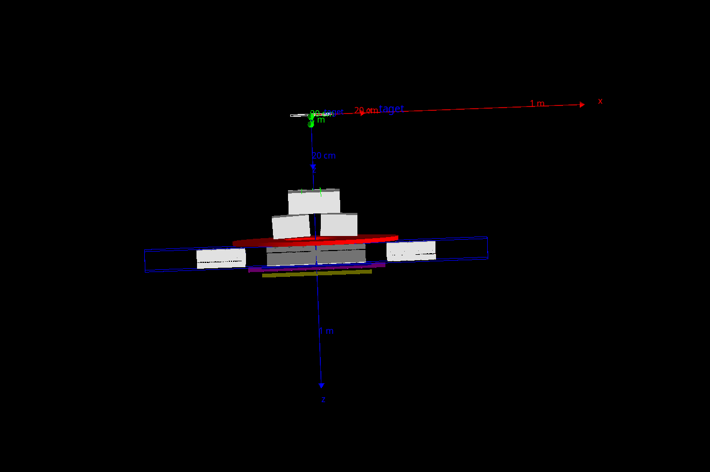

# 2019-01-27
## Git and GitHub workflow

### Creating a new repository from an existing GitHub one:

- fork project in GitHub account: creates a copy of the project/repository in my GitHub account at that time.

- At local server using git commands to interface with the project in GitHub. All git commands have to be executed inside a valid git repository, except git clone.

    1. `git clone [repository address]` to copy a remote repository locally and set up the git repository with a corresponding remote (web address) as origin - so it is recommended to that with the original one. In case we don't have access to the original repository, the connection should be done by using HTTPS.  
        Note: for personal repositories prefer the SHH connection over HTTPS, which allow to connect direclty without password (create ssh-keygen and add it in your GitHub account).
        *  `git remote -v` to show remote address connected to the that git repository. 
        * `git remote add [remote name] [repository address]` to add your personal repository. Recommended if you want to collaborate with the prject. Otherwise you can't do so.
    2. `git status` to see the status (differences between local and cloud rep. but this is done in the local repository so it won't be different if a git fetch isn't done before).
    3. `git fetch` to see the updates (new changes made in the cloud repository). A `git status` rigth after will show how many commits were made in this updated version.
    4. `git pull` to update the local  repository with the verion existing on the could.

### Creating a new repository from zero:
- Only on GitHub to then clone.
- This is also necessary when we want to put an existing local repository in GitHub.

    1. Click up-right button on GitHub to make new repository with a markdown readme text (*.md) by default.
    2. `git init` to initiate .git repository locally in the desired folder.
    3. `git remote add [remote name] [repository address]`
    e.g. add origin git@github.com:arbarbeiro/notebook.git
    Note: 'origin' is the [remore name] used by default  
    4. `git fetch` to see what is already in cloud.(also use git status to more info at any time).
    5. `git pull [remote name] [branch]` if there is any existing file, like a readme created by default, or if repository is empty, there is no need to pull.
    6. `git add [file name]` to add a new file to git to be tracked. 
    7. `git commit -m 'comment'` to ceate a git checkpoint (this is like a git save of changes done to the file). This is required before a git push to update these changes in the cloud repository.
    9. `git push origin master` to update the entire cloud repository with the locally one.
    Note: `git push --set-upstream origin master` to include [remote name] [branch]
    10. `git commit -am [comment]` Once a file is added to be tracked, following changes can directly be added and commited with command.

Test images in md file:

- If I want to specify the image size (github supports html image tag like below with width height attributes..., but to keep aspect ratio is better to only give specify one of these attributes): 
 
