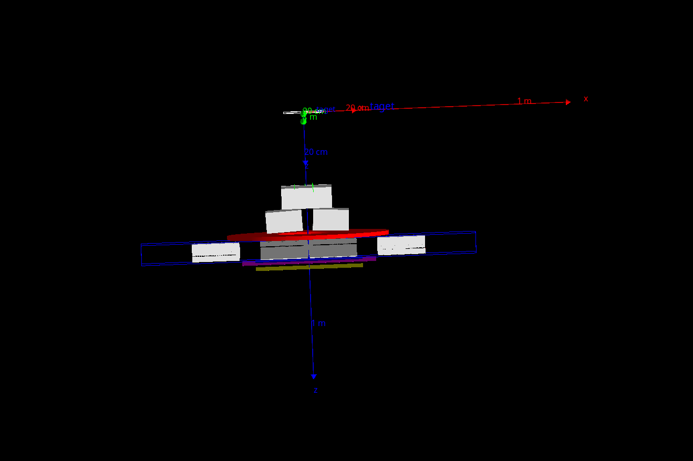

Example on how to include images in md file:

- If I want to specify the image size (github supports html image tag like below with width height attributes..., but to keep aspect ratio is better to only give specify one of these attributes): 